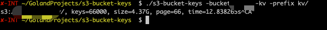

## s3-bucket-keys
一个查询S3存储桶中对象数量以及对象大小的命令行工具，支持前缀匹配，只查询特定前缀的对象，实时输出告知当前进度。



### 特性：
1. 比s3cmd快
2. 实时输出当前统计的信息：对象大小、对象数量、耗时
3. 支持对比两个桶中相同key是否一致

### 使用：

```shell
$ go mod tidy
$ go build .
$ ./s3-bucket-keys -bucket YOU-BUCKET -prefix YOU-KEY-PREFIX
# 对比key在两个桶中是否不一致
$ ./s3-bucket-keys -bucket SRC-BUCKET,DST-BUCKET -prefix YOU-KEY-PREFIX
```

命令参数：
```shell
  -bucket string
        S3 bucket name, Up to two buckets are supported, and multiple buckets are separated by commas
  -diff
        Compare whether the key prefix is consistent in the two buckets (by the number and size of keys)
  -prefix string
        S3 object key prefix, eg. /path/to/some-key

```

### 配置访问秘钥
[Get your AWS access keys
](https://aws.github.io/aws-sdk-go-v2/docs/getting-started/#get-your-aws-access-keys)